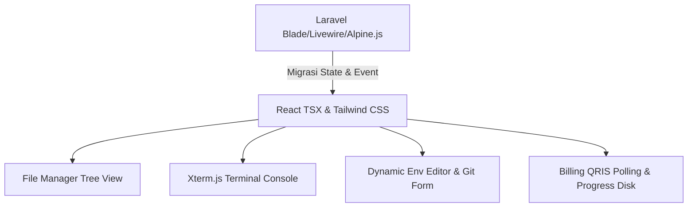

# BLUEPRINT FRONTEND UI/UX: SUBLY MANAGED HOSTING (REACT TYPESCRIPT MIGRATION)

## 1. STRUKTUR HALAMAN & PEMETAAN ROUTING (FRONTEND)

Proses pemetaan rute dilakukan dengan memisahkan halaman menjadi tiga kategori utama berdasarkan hak akses: **Public Routes** (Guest/Umum), **Protected User Routes** (Customer/Klien), dan **Protected Admin Routes** (Administrator). Setiap rute dirancang menggunakan sistem routing modern (seperti React Router v6 atau Next.js App Router).

### Rute Umum (Public / Guest Routes)
Rute-rute ini dapat diakses oleh publik tanpa memerlukan autentikasi. Jika pengguna sudah masuk, rute autentikasi (`/login`, `/register`) akan otomatis mengalihkan pengguna ke dashboard yang sesuai (`/dashboard` atau `/admin`).

| Rute Laravel Asal | Rute React Baru (SPA) | Keterangan Halaman | Layout |
| :--- | :--- | :--- | :--- |
| `/` | `/` | Landing Page (Informasi Layanan, Testimoni, Pricing Plans) | `PublicLayout` |
| `login` | `/login` | Form Login Klien / Admin | `AuthLayout` |
| `register` | `/register` | Form Pendaftaran Klien Baru | `AuthLayout` |
| `password.request` | `/forgot-password` | Form Permintaan Reset Kata Sandi | `AuthLayout` |
| `password.reset` | `/reset-password` | Form Reset Kata Sandi Baru | `AuthLayout` |
| `pages.terms` | `/terms` | Halaman Syarat & Ketentuan Layanan | `PublicLayout` |
| `pages.rules` | `/rules` | Aturan Penggunaan Server & Hosting | `PublicLayout` |
| `pages.purchase-terms` | `/purchase-terms` | Ketentuan Pembelian & Transaksi | `PublicLayout` |
| `pages.privacy` | `/privacy` | Kebijakan Privasi Pengguna | `PublicLayout` |

### Rute Klien Terproteksi (Protected User/Client Routes)
Halaman-halaman ini hanya dapat diakses oleh pengguna terautentikasi dengan peran `Customer`. Rute ini memerlukan verifikasi email (`MustVerifyEmail`).

| Rute Laravel Asal | Rute React Baru (SPA) | Keterangan Halaman | Layout / Wrapper |
| :--- | :--- | :--- | :--- |
| `verification.notice` | `/verify-email` | Notifikasi & Form Verifikasi Email | `AuthLayout` |
| `client.index` | `/dashboard` | Dashboard Utama (Status Server, Klaim Subdomain, List DB) | `DashboardLayout` |
| `client.portal` | `/dashboard/portal/:subdomainId` | Portal Pengelolaan Subdomain (Deploy ZIP, Git Connect, Env) | `DashboardLayout` |
| `client.subdomains.file-manager` | `/dashboard/portal/:subdomainId/file-manager` | File Manager Interaktif (Directory Tree, File Operations) | `DashboardLayout` |
| `client.plans.index` | `/dashboard/plans` | Halaman Pembelian Paket Hosting Baru | `DashboardLayout` |
| `client.checkout.qris` | `/dashboard/checkout/qris/:paymentId` | Checkout Gateway QRIS Statis dengan Polling Real-time | `DashboardLayout` |
| `client.checkout.success` | `/dashboard/checkout/success` | Halaman Sukses Pembayaran | `DashboardLayout` |
| `client.deployments.index` | `/dashboard/deployments` | Riwayat Deployment Aplikasi (Versi & Status build) | `DashboardLayout` |
| `client.chat.index` | `/dashboard/chat` | Live Chat Tiket Dukungan Admin (Upload Bukti Bayar) | `DashboardLayout` |
| `client.reports.index` | `/dashboard/reports` | Form Pelaporan Isu & Masalah Server | `DashboardLayout` |
| `client.notifications.index` | `/dashboard/notifications` | Pusat Notifikasi Klien | `DashboardLayout` |
| `profile.edit` | `/dashboard/profile` | Pengaturan Profil Akun & Ganti Kata Sandi | `DashboardLayout` |

### Rute Admin Terproteksi (Protected Admin Routes)
Halaman-halaman administratif yang hanya boleh diakses oleh pengguna terautentikasi dengan peran `Admin`.

| Rute Laravel Asal | Rute React Baru (SPA) | Keterangan Halaman | Layout / Wrapper |
| :--- | :--- | :--- | :--- |
| `admin.index` | `/admin` | Panel Utama Admin (Statistik Global, Log Queue, Chat Baru) | `AdminLayout` |
| `admin.disk.index` | `/admin/disk` | Analisis Kapasitas Disk Global Server | `AdminLayout` |
| `admin.plans.*` | `/admin/plans` | Manajemen Paket Hosting (CRUD) | `AdminLayout` |
| `admin.vouchers.*` | `/admin/vouchers` | Manajemen Kode Voucher Diskon (CRUD) | `AdminLayout` |
| `admin.users.*` | `/admin/users` | Manajemen Klien / Pengguna (CRUD) | `AdminLayout` |
| `admin.subdomains.*` | `/admin/subdomains` | Manajemen & Monitoring Subdomain Aktif | `AdminLayout` |
| `admin.databases.*` | `/admin/databases` | Monitoring Alokasi Database Client | `AdminLayout` |
| `admin.payments.index` | `/admin/payments` | Daftar Riwayat Pembayaran QRIS Klien | `AdminLayout` |
| `admin.payments.show` | `/admin/payments/:paymentId` | Detail Transaksi & Konfirmasi Pembayaran Manual | `AdminLayout` |
| `admin.deployments.index` | `/admin/deployments` | Antrean Deployment Global & Trigger Provisioning | `AdminLayout` |
| `admin.chat.index` | `/admin/chat` | Konsol Dukungan Live Chat (Pusat Chat Room Masuk) | `AdminLayout` |
| `admin.chat.show` | `/admin/chat/:userId` | Halaman Percakapan Chat Dukungan Aktif dengan Klien | `AdminLayout` |
| `admin.reports.index` | `/admin/reports` | Daftar Isu Laporan Klien | `AdminLayout` |
| `admin.notifications.*` | `/admin/notifications` | Broadcast Log Notifikasi & Form Kirim Notifikasi Global | `AdminLayout` |
| `admin.settings.index` | `/admin/settings` | Pengaturan QRIS Statis Sistem & Konfigurasi Dasar | `AdminLayout` |

---

## 2. DEKOMPOSISI KOMPONEN UI (COMPONENT BREAKDOWN)

Berikut adalah dekomposisi komponen-komponen UI modular yang akan diimplementasikan menggunakan arsitektur folder berbasis React TypeScript.

```
src/
├── components/
│   ├── ui/             # Komponen visual atomik dan reusable
│   ├── layout/         # Komponen struktural layout aplikasi
│   └── dashboard/      # Komponen spesifik fitur dashboard
```

### A. Komponen UI Dasar (`src/components/ui/`)

#### 1. `Button`
Tombol premium dengan variasi status loading, ikon, dan gaya linear-gradient.
*   **Props Interface (`ButtonProps`):**
    ```typescript
    interface ButtonProps extends React.ButtonHTMLAttributes<HTMLButtonElement> {
      variant?: 'primary' | 'secondary' | 'danger' | 'outline' | 'ghost';
      size?: 'sm' | 'md' | 'lg';
      isLoading?: boolean;
      icon?: React.ReactNode;
      iconPosition?: 'left' | 'right';
    }
    ```

#### 2. `Modal`
Dialog overlay dengan transisi backdrop blur premium (`backdrop-blur-md`) dan animasi scale-up.
*   **Props Interface (`ModalProps`):**
    ```typescript
    interface ModalProps {
      isOpen: boolean;
      onClose: () => void;
      title: string;
      description?: string;
      size?: 'sm' | 'md' | 'lg' | 'xl';
      children: React.ReactNode;
      footerActions?: React.ReactNode;
    }
    ```

#### 3. `Badge`
Label status kecil dengan skema warna HSL adaptif.
*   **Props Interface (`BadgeProps`):**
    ```typescript
    interface BadgeProps {
      status: 'active' | 'inactive' | 'success' | 'queued' | 'processing' | 'error' | 'pending' | 'failed';
      label: string;
      animate?: boolean;
    }
    ```

#### 4. `Toast`
Notifikasi mengambang dengan visualisasi bar progress transisi keluar.
*   **Props Interface (`ToastProps`):**
    ```typescript
    interface ToastProps {
      id: string;
      type: 'success' | 'error' | 'info' | 'warning';
      title: string;
      message: string;
      duration?: number;
      onClose: (id: string) => void;
    }
    ```

#### 5. `CardPanel`
Panel pembungkus transparan bergaya *glassmorphism* dengan border halus (`border-neutral-900/60`).
*   **Props Interface (`CardPanelProps`):**
    ```typescript
    interface CardPanelProps extends React.HTMLAttributes<HTMLDivElement> {
      glow?: boolean;
      glowColor?: string;
      title?: string;
      headerActions?: React.ReactNode;
    }
    ```

### B. Komponen Struktural Layout (`src/components/layout/`)

#### 1. `Sidebar`
Navigasi vertikal yang menciut (collapsible) secara dinamis membaca status role pengguna.
*   **Props Interface (`SidebarProps`):**
    ```typescript
    interface SidebarProps {
      isCollapsed: boolean;
      onToggleCollapse: () => void;
      currentRole: 'Admin' | 'Customer';
      activePath: string;
    }
    ```

#### 2. `Header`
Pusat kontrol atas berisi remah roti (breadcrumbs), bel notifikasi, dan avatar profil dropdown.
*   **Props Interface (`HeaderProps`):**
    ```typescript
    interface HeaderProps {
      user: {
        name: string;
        email: string;
        avatarUrl?: string;
      };
      unreadNotificationsCount: number;
      onLogout: () => Promise<void>;
    }
    ```

### C. Komponen Spesifik Fitur Dashboard (`src/components/dashboard/`)

#### 1. `StatusProgressBar`
Progress bar melengkung untuk visualisasi penggunaan kapasitas penyimpanan disk atau alokasi slot subdomain.
*   **Props Interface (`StatusProgressBarProps`):**
    ```typescript
    interface StatusProgressBarProps {
      used: number;
      max: number;
      unit: 'MB' | 'GB' | 'units';
      label: string;
      showWarningAt?: number; // Nilai persentase (e.g. 80)
      onAlertTrigger?: () => void;
    }
    ```

---

## 3. AUDIT FITUR TAMPILAN DAN INTERAKSI MANAGED HOSTING

Analisis rinci terhadap elemen antarmuka dinamis pada Laravel Subdomain Portal dan pemetaan interaksi di sisi React.



### A. File Manager UI
Fitur ini memindahkan backend Laravel Livewire (`FileManager.php` & `file-manager.blade.php`) ke sistem SPA.
*   **Struktur Pohon (Directory Tree):** Dirender menggunakan state tree rekursif lokal di React. Setiap baris mewakili folder atau berkas. Item folder dapat diklik untuk memperbarui state path (`requestedPath`).
*   **Safety Traversal Guard:** React harus menyembunyikan berkas penting di root direktori seperti `.env` dan `.git` secara visual untuk mencegah kerusakan sistem cPanel oleh pengguna (seperti logika baris 70-75 pada `FileManager.php`).
*   **Tombol Aksi Dinamis:** Menghapus berkas/direktori memicu modal konfirmasi custom (`Modal` konfirmasi hapus). Aksi hapus diblokir untuk berkas sistem kritis seperti `.htaccess` (logika baris 215 pada `FileManager.php`).
*   **Drag-and-Drop Area:** Terintegrasi di dashboard untuk unggah berkas `.zip`. Area dropzone menggunakan state drag untuk mengubah styling border menjadi solid white saat file melayang di atasnya. Mendukung validasi ukuran file secara instan sebelum melakukan request unggah ke backend.

### B. Terminal Log UI
Visualisasi proses deployment (provisioning & deprovisioning server) yang menirukan layar hitam terminal interaktif.
*   **Tampilan Layar Hitam (Terminal Console):** Kontainer hitam pekat (`#050507`) dengan font monospaced (`font-mono`) berukuran kecil (`text-[10px]`). Log stdout ditayangkan berwarna putih/hijau, sedangkan stderr berwarna merah/amber.
*   **Penanganan Auto-Scroll:** Komponen React menggunakan `useRef` yang diarahkan ke bagian bawah kontainer log. Setiap ada log baru masuk ke array state `logs`, useEffect akan menembak `.scrollIntoView({ behavior: 'smooth' })`.
*   **Visualisasi Status Koneksi:** Header konsol menampilkan indikator status koneksi (Connected/Disconnected) dengan sinyal berkedip (blinking effect) berwarna hijau untuk status aktif.
*   **Simulasi Stepper Alur Kerja Infrastruktur:**
    *   **Provisioning Stepper:** (1) Penyiapan Virtual Host -> (2) Alokasi Skema MySQL -> (3) Atur Hak Akses Database.
    *   **Deprovisioning Stepper:** (1) Hapus Virtual Host -> (2) Drop Database Schema -> (3) Revoke Credentials -> (4) Wipe Storage Files.

### C. Git & Env Form
*   **Integrasi GitHub:**
    *   Form input menerima repositori HTTPS URL dan opsional Personal Access Token (PAT).
    *   Aksi "Periksa Repositori" memicu pemanggilan AJAX ke backend untuk memvalidasi token dan URL. Saat sukses, state `isGitVerified` bernilai `true` dan daftar branch dinamis ditampilkan dalam custom dropdown.
    *   Dropdown branch mendukung pencarian input teks interaktif (fuzzy search).
*   **Editor Variabel Lingkungan (.env):**
    *   **Form Editor Mode:** Baris input berpasangan (`key` dan `value`). Input `key` otomatis dikonversi menjadi huruf kapital (uppercase) secara real-time dan divalidasi menggunakan ekspresi reguler. Pengguna dapat menambah baris baru secara instan atau menghapusnya.
    *   **Raw Editor Mode:** Editor berbasis `textarea` monospaced. Perubahan teks di textarea secara otomatis diparsing baris demi baris menggunakan regex `KEY=VALUE` saat berpindah tab ke Form Editor Mode.

### D. Billing & Subscription Dashboard
*   **Desain Kartu Paket:** Kartu grid minimalis yang menampilkan harga paket, batas penyimpanan, batas database, durasi masa aktif, serta form pengisian kode voucher diskon.
*   **Progress Bar Kapasitas:** Progress bar berwarna putih secara default. Menggunakan visualisasi adaptif: berubah menjadi warna amber jika kapasitas disk mencapai >80%, dan merah pekat jika mencapai 100% (penyimpanan penuh) disertai dengan kemunculan tombol "Minta Tambahan Disk".
*   **QRIS Gateway Statis & Polling Status:**
    *   Menampilkan gambar QRIS statis dari database pengaturan admin.
    *   Menyajikan instruksi nominal bayar yang unik dengan format nominal yang ditambah dengan 3 digit kode transfer unik (`unique_code`).
    *   Menjalankan polling request otomatis ke REST API `/checkout/status/:paymentId` setiap 5 detik. Jika status berubah menjadi `success`, sistem akan menghentikan interval polling dan mengalihkan pengguna ke halaman sukses.

---

## 4. FORM VALIDATION & CLIENT-SIDE LOGIC

Semua aturan validasi visual diatur menggunakan pustaka **React Hook Form** yang dikombinasikan dengan skema deklaratif dari **Zod**.

### Pustaka yang Direkomendasikan
*   `react-hook-form` (Manajemen State Form & Event Penyerahan)
*   `@hookform/resolvers` (Adapter untuk Zod)
*   `zod` (Skema Validasi Tipe Data)

### Pemetaan Aturan Validasi Form

```
Form Login Klien/Admin:
├── email    --> Required, Format Email Valid
└── password --> Required

Form Pendaftaran Klien Baru:
├── name                  --> Required, Minimal 3 Karakter
├── email                 --> Required, Format Email Valid
├── password              --> Required, Minimal 8 Karakter
└── password_confirmation --> Required, Harus Cocok dengan password

Form Klaim Subdomain Baru:
├── name       --> Required, Regex: /^[a-zA-Z0-9\-_]+$/ (Tanpa spasi/titik)
└── payment_id --> Required, Integer

Form Tambah Baris / Edit .env:
├── key   --> Required, Regex: /^[A-Z_][A-Z0-9_]*$/ (Uppercase otomatis)
└── value --> Required, Maksimal 1000 Karakter

Form Permintaan Disk Tambahan:
├── size_preset --> Required (Preset terpilih atau 'Custom')
├── custom_size --> Kondisional (Jika preset 'Custom', Minimum 1 MB, Maksimum 51200 MB)
└── reason      --> Required, Minimal 10 Karakter
```

---

## 5. STATE MANAGEMENT & DATA FETCHING REQUIREMENT

Aplikasi React SPA membutuhkan manajemen state global yang efisien untuk data yang diakses oleh banyak halaman, serta penanganan komunikasi asinkron real-time untuk log server dan live chat.

```
State Management & Data Fetching:
├── Global State Management (Zustand)
│   ├── User Auth Context (Session, Role)
│   ├── Notification Status Center
│   └── Global Server Health Status
│
└── Async Data Fetching & Live Stream
    ├── REST API Polling (React Query) -> Status Transaksi QRIS (Setiap 5 Detik)
    └── WebSockets (Laravel Echo)     -> Real-time Terminal Logs & Live Chat Messages
```

### A. Global State Management (Zustand)
Zustand digunakan karena ukurannya yang sangat ringan, performa tinggi, dan sintaksisnya yang minim boilerplate untuk TypeScript.
*   **Store yang Dibutuhkan:**
    1.  `useAuthStore`: Menyimpan data sesi login pengguna, data token akses JWT, status peran (`Customer` / `Admin`), dan status verifikasi email.
    2.  `useNotificationStore`: Menyimpan status antrean notifikasi belum dibaca serta trigger pop-up notifikasi global.
    3.  `useSystemStore`: Menyimpan status global sidebar (collapsed/expanded) dan preferensi tema gelap (dark mode).

### B. Strategi Komunikasi Asinkron & Real-time
*   **REST API Polling (React Query):**
    Digunakan untuk melacak status transaksi pada halaman pembayaran QRIS (`/dashboard/checkout/qris/:paymentId`). React Query akan menjalankan query berkala setiap 5 detik (`refetchInterval: 5000`) ke endpoint `/checkout/status/:paymentId`.
*   **WebSockets (Laravel Echo & Pusher / Socket.io-client):**
    Digunakan untuk fitur-fitur interaktif dengan latensi rendah:
    1.  **Terminal Log Stream:** Saat deployment berjalan, server mengirimkan output log stdout/stderr baris-demi-baris melalui channel WebSocket `subdomain.{id}.deployments`. Komponen `TerminalConsole` mendengarkan channel ini untuk menampilkan logs secara instan.
    2.  **Live Support Chat:** Mengirimkan pesan chat dan notifikasi admin secara instan tanpa perlu memuat ulang halaman chat melalui channel privat `user.{id}.chats`.

---

## 6. DEFINISI TYPESCRIPT INTERFACES

Buat berkas deklarasi tipe `src/types/index.ts` yang selaras dengan skema model data dari Laravel Backend:

```typescript
// src/types/index.ts

export type UserRole = 'Admin' | 'Customer';

export interface User {
  id: number;
  name: string;
  email: string;
  role: UserRole;
  email_verified_at: string | null;
  last_seen_at: string | null;
  created_at: string;
  updated_at: string;
}

export type SubdomainStatus = 'active' | 'inactive';

export interface Subdomain {
  id: number;
  user_id: number;
  name: string;
  full_domain: string;
  doc_root: string;
  status: SubdomainStatus;
  expired_at: string | null;
  storage_override_mb: number | null;
  git_url: string | null;
  git_branch: string | null;
  git_last_commit: string | null;
  git_connected_at: string | null;
  created_at: string;
  updated_at: string;
  userDatabases?: UserDatabase[];
  envs?: SubdomainEnv[];
  deployments?: Deployment[];
}

export interface UserDatabase {
  id: number;
  subdomain_id: number;
  db_name: string;
  db_user: string;
  db_password?: string; // Disembunyikan di beberapa respon API demi keamanan
  created_at: string;
  updated_at: string;
}

export interface SubdomainEnv {
  id: number;
  subdomain_id: number;
  key: string;
  value: string;
  is_secret: boolean;
  created_at: string;
}

export type DeploymentStatus = 'queued' | 'processing' | 'success' | 'error';

export interface Deployment {
  id: number;
  subdomain_id: number;
  zip_path: string | null;
  zip_size: number;
  extracted_size: number;
  version: number;
  status: DeploymentStatus;
  notes: string | null;
  admin_note: string | null;
  deployed_at: string | null;
  created_at: string;
  updated_at: string;
}

export type PaymentStatus = 'pending' | 'success' | 'failed';

export interface Payment {
  id: number;
  user_id: number;
  plan_id: number;
  voucher_id: number | null;
  subdomain_id: number | null;
  transaction_id: string;
  amount: number;
  unique_code: number;
  proof_path: string | null;
  status: PaymentStatus;
  created_at: string;
  updated_at: string;
  plan?: Plan;
  subdomain?: Subdomain;
}

export interface Plan {
  id: number;
  name: string;
  price: number;
  type: 'PHP' | 'NodeJS';
  description: string | null;
  max_storage_mb: number;
  max_databases: number;
  duration_months: number;
  is_active: boolean;
  created_at: string;
}

export interface LogLine {
  timestamp: string;
  type: 'stdout' | 'stderr' | 'system';
  message: string;
}

export interface ChatMessage {
  id: number;
  user_id: number;
  message: string;
  image_path: string | null;
  is_admin: boolean;
  is_read: boolean;
  created_at: string;
  updated_at: string;
}
```

---

## 7. CONTOH IMPLEMENTASI KOMPONEN KRITIS (REACT TYPESCRIPT)

### A. TerminalConsole Component (`src/components/dashboard/TerminalConsole.tsx`)
Komponen visual untuk merender log deployment real-time dengan fungsionalitas auto-scroll dan penanganan status koneksi.

```tsx
import React, { useEffect, useRef, useState } from 'react';
import { LogLine } from '../../types';

interface TerminalConsoleProps {
  logs: LogLine[];
  connectionStatus: 'connecting' | 'connected' | 'disconnected';
  onRetryConnection?: () => void;
  title?: string;
}

export const TerminalConsole: React.FC<TerminalConsoleProps> = ({
  logs,
  connectionStatus,
  onRetryConnection,
  title = "Infrastruktur Deployment Console"
}) => {
  const terminalEndRef = useRef<HTMLDivElement>(null);
  const [autoScroll, setAutoScroll] = useState<boolean>(true);

  // Auto-scroll ke bagian bawah log saat logs bertambah
  useEffect(() => {
    if (autoScroll && terminalEndRef.current) {
      terminalEndRef.current.scrollIntoView({ behavior: 'smooth' });
    }
  }, [logs, autoScroll]);

  // Handler scroll manual untuk mendeteksi jika user scroll ke atas
  const handleScroll = (e: React.UIEvent<HTMLDivElement>) => {
    const target = e.currentTarget;
    // Toleransi 20px dari bawah
    const isAtBottom = target.scrollHeight - target.scrollTop <= target.clientHeight + 20;
    setAutoScroll(isAtBottom);
  };

  return (
    <div className="w-full bg-[#050507] border border-neutral-900 rounded-2xl overflow-hidden shadow-2xl flex flex-col font-mono text-xs text-neutral-350">
      {/* Console Header */}
      <div className="px-5 py-3.5 border-b border-neutral-900 bg-neutral-950/80 flex items-center justify-between select-none">
        <div className="flex items-center gap-2">
          <div className="flex gap-1.5">
            <span className="w-3 h-3 rounded-full bg-red-500/80"></span>
            <span className="w-3 h-3 rounded-full bg-yellow-500/80"></span>
            <span className="w-3 h-3 rounded-full bg-green-500/80"></span>
          </div>
          <span className="text-[10px] text-neutral-450 font-bold tracking-wider uppercase ml-2">{title}</span>
        </div>
        
        {/* Connection Status Indicator */}
        <div className="flex items-center gap-2">
          {connectionStatus === 'connected' && (
            <span className="flex items-center gap-1.5 text-[9px] font-bold uppercase tracking-wider text-emerald-400 bg-emerald-500/5 px-2 py-0.5 rounded border border-emerald-500/20">
              <span className="w-1.5 h-1.5 rounded-full bg-emerald-500 animate-ping"></span>
              Connected
            </span>
          )}
          {connectionStatus === 'connecting' && (
            <span className="flex items-center gap-1.5 text-[9px] font-bold uppercase tracking-wider text-amber-400 bg-amber-500/5 px-2 py-0.5 rounded border border-amber-500/20 animate-pulse">
              Connecting
            </span>
          )}
          {connectionStatus === 'disconnected' && (
            <div className="flex items-center gap-2">
              <span className="flex items-center gap-1.5 text-[9px] font-bold uppercase tracking-wider text-red-400 bg-red-500/5 px-2 py-0.5 rounded border border-red-500/20">
                Disconnected
              </span>
              {onRetryConnection && (
                <button 
                  onClick={onRetryConnection}
                  className="text-[9px] font-bold uppercase tracking-wider text-white hover:underline bg-neutral-900 border border-neutral-850 px-2 py-0.5 rounded cursor-pointer active:scale-95"
                >
                  Reconnect
                </button>
              )}
            </div>
          )}
        </div>
      </div>

      {/* Logs Output Box */}
      <div 
        onScroll={handleScroll}
        className="flex-1 p-5 h-64 overflow-y-auto space-y-1.5 scrollbar-thin scrollbar-thumb-neutral-900 scrollbar-track-transparent text-left"
      >
        <div className="flex items-start gap-1.5 text-neutral-600 mb-2">
          <span>$</span>
          <span className="text-neutral-400">subly-provisioner --verbose --target=host_env</span>
        </div>

        {logs.map((log, index) => {
          let lineClass = "text-neutral-350"; // Standard stdout
          if (log.type === 'stderr') lineClass = "text-red-400 font-semibold";
          if (log.type === 'system') lineClass = "text-cyan-400 font-bold";

          return (
            <div key={index} className={`flex items-start gap-2.5 leading-relaxed ${lineClass}`}>
              <span className="text-neutral-700 select-none text-[10px] pt-0.5">[{log.timestamp}]</span>
              <span className="whitespace-pre-wrap break-all">{log.message}</span>
            </div>
          );
        })}
        
        {/* Helper anchor for auto-scroll */}
        <div ref={terminalEndRef} />
      </div>
    </div>
  );
};
```

### B. FileManager Component (`src/components/dashboard/FileManager.tsx`)
Komponen explorer file dengan visualisasi path, navigasi folder, pencarian, dan penanganan aksi hapus berkas.

```tsx
import React, { useState } from 'react';
import { Badge } from '../ui/Badge';

export interface FileItem {
  name: string;
  path: string;
  is_dir: boolean;
  size: string;
  size_bytes: number;
  last_modified: string;
  extension: string;
}

interface FileManagerProps {
  subdomainName: string;
  initialFolders: FileItem[];
  initialFiles: FileItem[];
  onNavigate: (path: string) => void;
  onDelete: (item: FileItem) => void;
  currentPath: string;
}

export const FileManager: React.FC<FileManagerProps> = ({
  subdomainName,
  initialFolders,
  initialFiles,
  onNavigate,
  onDelete,
  currentPath
}) => {
  const [searchTerm, setSearchTerm] = useState<string>('');

  // Navigasi breadcrumbs
  const getBreadcrumbs = () => {
    if (!currentPath) return [];
    const parts = currentPath.split('/');
    let accumulatedPath = '';
    return parts.map((part) => {
      accumulatedPath = accumulatedPath ? `${accumulatedPath}/${part}` : part;
      return { name: part, path: accumulatedPath };
    });
  };

  // Naik satu level path
  const handleGoUp = () => {
    if (!currentPath) return;
    const parts = currentPath.split('/');
    parts.pop();
    onNavigate(parts.join('/'));
  };

  // Filter file dan folder berdasarkan pencarian
  const filteredFolders = initialFolders.filter(f => f.name.toLowerCase().includes(searchTerm.toLowerCase()));
  const filteredFiles = initialFiles.filter(f => f.name.toLowerCase().includes(searchTerm.toLowerCase()));

  // Render SVG Icon spesifik berdasarkan tipe ekstensi berkas
  const getFileIcon = (ext: string) => {
    const extension = ext.toLowerCase();
    if (['png', 'jpg', 'jpeg', 'gif', 'svg', 'webp', 'ico'].includes(extension)) {
      return (
        <svg className="w-5 h-5 text-emerald-400 shrink-0" fill="none" viewBox="0 0 24 24" stroke="currentColor" strokeWidth="2">
          <path strokeLinecap="round" strokeLinejoin="round" d="M2.25 15.75l5.159-5.159a2.25 2.25 0 013.182 0l5.159 5.159m-1.5-1.5l1.409-1.409a2.25 2.25 0 013.182 0l2.909 2.909m-18 3.75h16.5a1.5 1.5 0 001.5-1.5V6a1.5 1.5 0 00-1.5-1.5H3.75A1.5 1.5 0 002.25 6v12a1.5 1.5 0 001.5 1.5zm10.5-11.25h.008v.008h-.008V8.25zm.375 0a.375.375 0 11-.75 0 .375.375 0 01.75 0z" />
        </svg>
      );
    }
    if (['zip', 'rar', 'tar', 'gz', '7z'].includes(extension)) {
      return (
        <svg className="w-5 h-5 text-rose-400 shrink-0" fill="none" viewBox="0 0 24 24" stroke="currentColor" strokeWidth="2">
          <path strokeLinecap="round" strokeLinejoin="round" d="M20.25 7.5l-.625 10.632a2.25 2.25 0 01-2.247 2.118H6.622a2.25 2.25 0 01-2.247-2.118L3.75 7.5M10 11.25h4M3.375 7.5h17.25c.621 0 1.125-.504 1.125-1.125v-1.5c0-.621-.504-1.125-1.125-1.125H3.375c-.621 0-1.125.504-1.125 1.125v1.5c0 .621.504 1.125 1.125 1.125z" />
        </svg>
      );
    }
    if (['php', 'html', 'css', 'js', 'json', 'py', 'sh', 'sql', 'ts', 'jsx', 'tsx'].includes(extension)) {
      return (
        <svg className="w-5 h-5 text-cyan-400 shrink-0" fill="none" viewBox="0 0 24 24" stroke="currentColor" strokeWidth="2">
          <path strokeLinecap="round" strokeLinejoin="round" d="M17.25 6.75L22.5 12l-5.25 5.25m-10.5 0L1.5 12l5.25-5.25m7.5-3l-4.5 16.5" />
        </svg>
      );
    }
    return (
      <svg className="w-5 h-5 text-neutral-450 shrink-0" fill="none" viewBox="0 0 24 24" stroke="currentColor" strokeWidth="2">
        <path strokeLinecap="round" strokeLinejoin="round" d="M19.5 14.25v-2.625a3.375 3.375 0 00-3.375-3.375h-1.5A1.125 1.125 0 0113.5 7.125v-1.5a3.375 3.375 0 00-3.375-3.375H8.25m2.25 0H5.625c-.621 0-1.125.504-1.125 1.125v17.25c0 .621.504 1.125 1.125 1.125h12.75c.621 0 1.125-.504 1.125-1.125V11.25a9 9 0 00-9-9z" />
      </svg>
    );
  };

  return (
    <div className="w-full flex flex-col gap-6 select-none">
      {/* File Manager Title and Search bar */}
      <div className="flex flex-col sm:flex-row sm:items-center sm:justify-between gap-4">
        <div>
          <h1 className="text-lg font-black text-white tracking-tight uppercase">File Manager: {subdomainName}</h1>
          <p className="text-[10px] text-neutral-500 font-bold mt-0.5 uppercase tracking-wide">Kelola berkas lokal di document root server Anda secara mandiri.</p>
        </div>
        <div className="relative w-full sm:w-64">
          <input 
            type="text"
            placeholder="Cari berkas..."
            value={searchTerm}
            onChange={(e) => setSearchTerm(e.target.value)}
            className="w-full bg-[#050507] border border-neutral-900 hover:border-neutral-800 focus:border-neutral-700 rounded-xl px-4 py-2.5 text-xs font-semibold text-neutral-200 placeholder-neutral-600 outline-none transition-all"
          />
        </div>
      </div>

      {/* Path Breadcrumbs Navigation Header */}
      <div className="bg-neutral-950/40 backdrop-blur-md border border-neutral-900/60 px-6 py-4 rounded-2xl flex items-center justify-between shadow-lg">
        <div className="flex items-center gap-2 text-xs font-bold uppercase tracking-wider text-neutral-400 select-none">
          <svg className="w-4 h-4 text-neutral-500 shrink-0" fill="none" viewBox="0 0 24 24" stroke="currentColor" strokeWidth="2.5">
            <path strokeLinecap="round" strokeLinejoin="round" d="M3.75 9h16.5m-16.5 6.75h16.5M3.75 5.25h16.5M3.75 18.75h16.5" />
          </svg>
          <button onClick={() => onNavigate('')} className="hover:text-white transition-colors cursor-pointer">Root</button>
          
          {getBreadcrumbs().map((bc, idx) => (
            <React.Fragment key={idx}>
              <span className="text-neutral-700 font-mono">/</span>
              <button 
                onClick={() => onNavigate(bc.path)} 
                className="hover:text-white transition-colors max-w-[120px] truncate cursor-pointer"
              >
                {bc.name}
              </button>
            </React.Fragment>
          ))}
        </div>

        {currentPath !== '' && (
          <button 
            onClick={handleGoUp}
            className="text-[9px] font-black uppercase tracking-widest text-neutral-300 hover:text-white transition-all bg-neutral-900 border border-neutral-850 hover:border-neutral-700 px-3 py-1.5 rounded-lg active:scale-95 flex items-center gap-1.5 cursor-pointer"
          >
            <svg className="w-3 h-3 text-neutral-400" fill="none" viewBox="0 0 24 24" stroke="currentColor" strokeWidth="3">
              <path strokeLinecap="round" strokeLinejoin="round" d="M9 15L3 9m0 0l6-6M3 9h12a6 6 0 010 12h-3" />
            </svg>
            Naik Satu Tingkat
          </button>
        )}
      </div>

      {/* Explorer Panel Card */}
      <div className="bg-neutral-950/40 backdrop-blur-md border border-neutral-900 rounded-3xl overflow-hidden shadow-2xl flex flex-col w-full relative">
        <div className="px-6 py-4 border-b border-neutral-900/60 bg-neutral-950/20 flex justify-between items-center">
          <h3 className="text-xs font-bold text-neutral-400 uppercase tracking-widest flex items-center gap-2">
            <svg className="w-4 h-4 text-neutral-500" fill="none" stroke="currentColor" strokeWidth="2" viewBox="0 0 24 24">
              <path strokeLinecap="round" strokeLinejoin="round" d="M3.75 5.25h16.5m-16.5 4.5h16.5m-16.5 4.5h16.5m-16.5 4.5h16.5" />
            </svg>
            Daftar Berkas & Folder
          </h3>
          <span className="text-[9px] font-bold bg-neutral-900 border border-neutral-850 px-2 py-0.5 rounded text-neutral-500 uppercase tracking-wider">
            Total: {initialFolders.length + initialFiles.length} Item
          </span>
        </div>

        <div className="overflow-x-auto w-full">
          <table className="w-full text-left">
            <thead>
              <tr className="bg-neutral-950/80 text-[10px] text-neutral-500 uppercase tracking-widest">
                <th className="py-4 px-6 font-bold">Nama</th>
                <th className="py-4 px-6 text-center font-bold">Ukuran</th>
                <th className="py-4 px-6 text-center font-bold">Waktu Modifikasi</th>
                <th className="py-4 px-6 text-right font-bold pr-8">Aksi</th>
              </tr>
            </thead>
            <tbody className="divide-y divide-neutral-900/40">
              
              {/* Render Folders */}
              {filteredFolders.map((folder, index) => (
                <tr key={`folder-${index}`} className="group hover:bg-neutral-900/10 transition-colors">
                  <td className="py-3 px-6">
                    <button 
                      onClick={() => onNavigate(folder.path)} 
                      className="font-bold text-white hover:text-neutral-350 flex items-center gap-3 transition-colors text-xs font-mono cursor-pointer select-none"
                    >
                      <svg className="w-5 h-5 text-amber-400 shrink-0 transition-transform group-hover:scale-105 duration-200" fill="none" viewBox="0 0 24 24" stroke="currentColor" strokeWidth="2">
                        <path strokeLinecap="round" strokeLinejoin="round" d="M2.25 12.75V12A2.25 2.25 0 014.5 9.75h15A2.25 2.25 0 0121.75 12v.75m-19.5 0A2.25 2.25 0 004.5 15h15a2.25 2.25 0 002.25-2.25m-19.5 0v.25A2.25 2.25 0 004.5 17.5h15a2.25 2.25 0 002.25-2.25M12 9.75V3m0 0L9 6m3-3l3 3" />
                      </svg>
                      <span className="truncate max-w-[200px] sm:max-w-md">{folder.name}</span>
                    </button>
                  </td>
                  <td className="py-3 px-6 text-center font-mono text-[10px] text-neutral-600 font-bold">-</td>
                  <td className="py-3 px-6 text-center text-[10px] font-semibold text-neutral-450">{folder.last_modified}</td>
                  <td className="py-3 px-6 text-right pr-8">
                    <button 
                      onClick={() => onDelete(folder)}
                      className="text-neutral-655 hover:text-red-400 transition-colors cursor-pointer p-1.5 rounded-lg hover:bg-neutral-900 border border-transparent hover:border-neutral-850 active:scale-95 inline-flex"
                      title="Hapus Direktori"
                    >
                      <svg className="w-4 h-4" fill="none" viewBox="0 0 24 24" stroke="currentColor" stroke-width="2.5">
                        <path strokeLinecap="round" strokeLinejoin="round" d="M19 7l-.867 12.142A2 2 0 0116.138 21H7.862a2 2 0 01-1.995-1.858L5 7m5 4v6m4-6v6m1-10V4a1 1 0 00-1-1h-4a1 1 0 00-1 1v3M4 7h16" />
                      </svg>
                    </button>
                  </td>
                </tr>
              ))}

              {/* Render Files */}
              {filteredFiles.map((file, index) => (
                <tr key={`file-${index}`} className="group hover:bg-neutral-900/10 transition-colors">
                  <td className="py-3 px-6">
                    <div className="font-medium text-neutral-350 group-hover:text-white flex items-center gap-3 transition-colors text-xs font-mono truncate select-none">
                      {getFileIcon(file.extension)}
                      <span className="truncate max-w-[200px] sm:max-w-md">{file.name}</span>
                    </div>
                  </td>
                  <td className="py-3 px-6 text-center font-mono text-xs text-neutral-300 font-bold">{file.size}</td>
                  <td className="py-3 px-6 text-center text-[10px] font-semibold text-neutral-450">{file.last_modified}</td>
                  <td className="py-3 px-6 text-right pr-8">
                    <button 
                      onClick={() => onDelete(file)}
                      className="text-neutral-655 hover:text-red-400 transition-colors cursor-pointer p-1.5 rounded-lg hover:bg-neutral-900 border border-transparent hover:border-neutral-850 active:scale-95 inline-flex"
                      title="Hapus Berkas"
                    >
                      <svg className="w-4 h-4" fill="none" viewBox="0 0 24 24" stroke="currentColor" stroke-width="2.5">
                        <path strokeLinecap="round" strokeLinejoin="round" d="M19 7l-.867 12.142A2 2 0 0116.138 21H7.862a2 2 0 01-1.995-1.858L5 7m5 4v6m4-6v6m1-10V4a1 1 0 00-1-1h-4a1 1 0 00-1 1v3M4 7h16" />
                      </svg>
                    </button>
                  </td>
                </tr>
              ))}

              {/* Empty State */}
              {filteredFolders.length === 0 && filteredFiles.length === 0 && (
                <tr>
                  <td colSpan={4} className="py-16 text-center text-neutral-500 italic font-semibold text-xs">
                    <div className="flex flex-col items-center justify-center gap-3">
                      <svg className="w-8 h-8 text-neutral-700" fill="none" viewBox="0 0 24 24" stroke="currentColor" stroke-width="1.5">
                        <path strokeLinecap="round" strokeLinejoin="round" d="M20.25 7.5l-.625 10.632a2.25 2.25 0 01-2.247 2.118H6.622a2.25 2.25 0 01-2.247-2.118L3.75 7.5M10 11.25h4M3.375 7.5h17.25c.621 0 1.125-.504 1.125-1.125v-1.5c0-.621-.504-1.125-1.125-1.125H3.375c-.621 0-1.125.504-1.125 1.125v1.5c0 .621.504 1.125 1.125 1.125z" />
                      </svg>
                      <p>Direktori ini kosong.</p>
                    </div>
                  </td>
                </tr>
              )}
            </tbody>
          </table>
        </div>
      </div>
    </div>
  );
};
```
